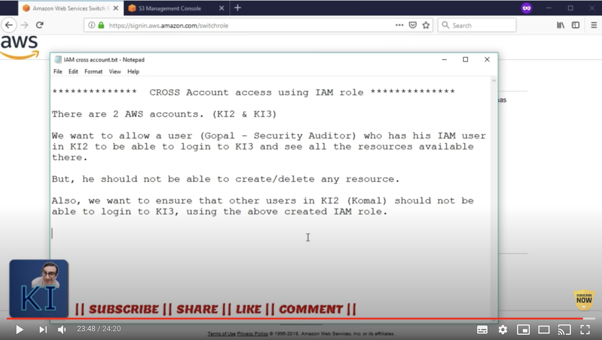

# AWS_AssumeRole
Terraform configurations where an IAM user in one AWS account is able to assume an IAM role in another AWS account. The use is then able to create AWS resources in the second AWS account
=======
# Inspiration

The purpose of this repo is to learn Terraform by coding the infrastructure in AWS.

This github repository is inspired by a [KnowledgeIndia](https://www.youtube.com/knowledgeIndia) YouTube tutorial, [AWS - cross account access using IAM role](https://www.youtube.com/watch?v=n1r9Fp7GKvk), where the presenter with help of a demo explained the concept very well. The scope and the concept of that tutorial is shown in the screenshot below _(click to watch the video)_.

<p align="left">
  <a href="https://www.youtube.com/watch?v=n1r9Fp7GKvk">
    
  </a>
</p>

## Scope of this repo

The purpose in this repo is not to repeat what has already been explained in the video. It is expected that the required setup is already in place _(e.g. AWS accounts, [IAM users](https://youtu.be/DXNS-EP9sXM) and roles)_.

Building on from the video instructions, we will write configurations _(**IaC**)_ in terraform that when executed will create infrastructure in AWS. This repository shows:

1. Configurations _(**`dev_machine_configs`** folder)_ required for an IAM user with MFA enabled in AWS account #1 to be able to assume an IAM role in AWS account #2
1. Scripts _(**`getCredentials.sh`**)_ that allow getting temporary security credentials from AWS account #2 in order to build infrastructure in AWS acount #2
    - Typically, you use AssumeRole within your account or for cross-account access. It returns a set of temporary security credentials that you can use to access AWS resources that you might not normally have access to. These temporary credentials consist of an access key ID, a secret access key, and a security token.
1. Commands to build infrastructure in AWS account #2. Example Terraform configuration _(**`main.tf`**)_ will build a VPC.

## Assumptions

- Users have been able to follow the demo along and understood the concepts in the above video tutorial 
- As explained in the tutorial above, users have multiple AWS accounts to experiment with; an initial account to log in to and other accounts where IAM roles will be assumed into. 
  - You might find this KnowledgeIndia tutorial helpful in understanding how to [organize multiple AWS accounts](https://youtu.be/-HsfTwdRxRI)
- Users have necessary tools installed on their dev machines / laptops i.e. [Terraform](https://www.terraform.io/), [jq](https://stedolan.github.io/jq/) and [AWS CLI](https://aws.amazon.com/cli/) _(this solution has been tested on a MacBook Pro)_.

## Pre-requisite

It is expected that the required setup is already in place:

- AWS account #1
  - In this initial account, an IAM user has been granted [permissions](https://docs.aws.amazon.com/IAM/latest/UserGuide/id_roles_use_permissions-to-switch.html) to assume STS roles; as explained in the tutorial above
- AWS account #2
  - In this account, an IAM [role](https://docs.aws.amazon.com/IAM/latest/UserGuide/id_roles_create_for-user.html) have been created that users from the initial AWS acount are allowed to assume into; as explained in the tutorial above

## Directory structure of this repo

```
.
├── README.md
├── dev_machine_configs
│   ├── README.md             --> Instructions required to configure local dev machine
│   ├── config                --> Update the file with AWS accounts #1 and #2. This will needs to be coppied in "~/.aws/"
│   ├── credentials           --> Update the file with IAM user credentials. This will needs to be coppied in "~/.aws/"
│   └── getCredentials.sh     --> Update the file with AWS accounts #2 and role name.
├── main.tf                   --> Update the "region" value
└── pics
    └── iam_role.png
```

## 1. Configurations

These configurations are required for an IAM user with MFA enabled in AWS account #1 to be able to assume an IAM role in AWS account #2
- Change to _**`dev_machine_configs`**_ folder of this repo and follow the README instructions.

## 2. Scripts

The script allows getting temporary security credentials from AWS account #2 in order to build infrastructure in AWS acount #2

- "`. ~/.aws/getCredentials.sh`" Terraform will require the temporary credentials that this script returns. They are exported as environment variables

## 3. Commands

- "`terraform init`" The first command to run in order to initialize plugins
- "`terraform plan`" This command will show the plan that Terraform will build
- "`terraform apply -auto-approve`" Once you are happy with the plan, this command will then build the infrastructure as per your configuration. In this repo, only a VPC will be built in the AWS account 2.

## 4. Testing

- With the IAM user, log in to AWS account #1 via [AWS console](https://console.aws.amazon.com/)
- Switch to the IAM role in AWS account #2 and check the a VPC has been created
- "`terraform destroy -auto-approve`" Destroy the infrastructure if it is no longer needed

## References
- TBD
